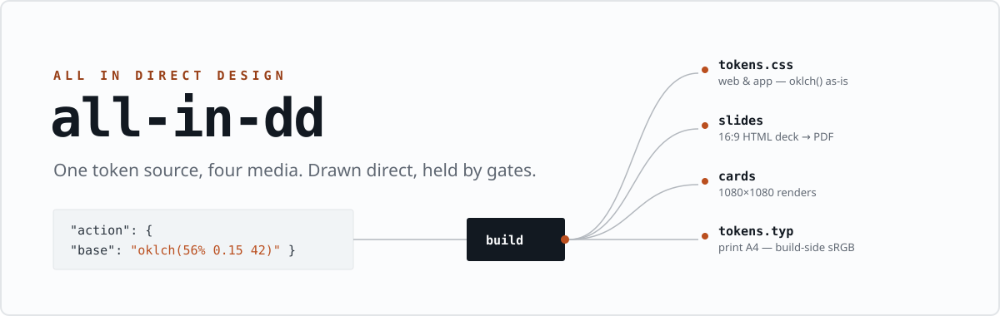
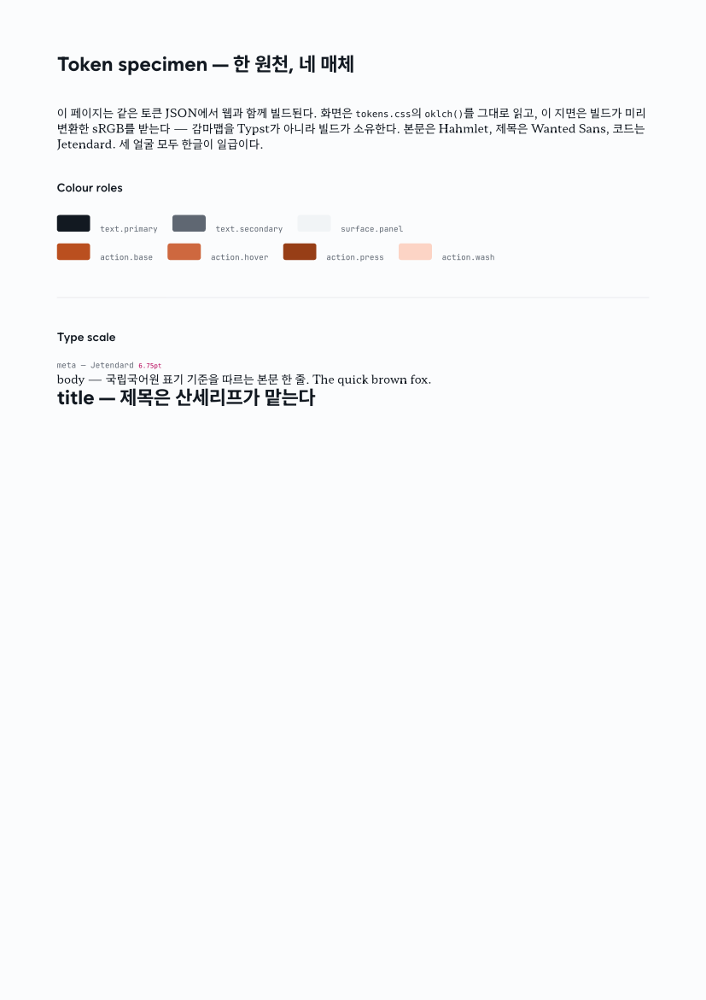

<p align="center"></p>



<p align="right"><a href="README.ko.md">한국어</a></p>

**all-in-dd** — *all in direct design* — is a design-system skeleton for working
with coding agents. One brand keeps its values in one set of DTCG token JSON, and
a single build fans them out to four media: web, slide decks, card-news images,
and print.

The other half of the repo is a set of gates. Ask a capable model for a landing
page and you get the median of its training data. The tempting fix is a blacklist
— no gradients, no glass, no dark mode — and it does not work, because slop is a
completion problem rather than a vocabulary one. A glass interface built with care
is not slop; an editorial layout built without decisions is. So the gates ask a
different question: **was a decision made here, or did a default arrive?**

This page was typeset from `brands/example` tokens alone. No literal values in
the source. The same JSON ships to the web as raw `oklch()` and to print as
build-converted sRGB:

<p align="center"></p>

```
tokens/*.json ──▶ npm run build:tokens ──▶ dist/tokens.css   web · slides · cards
                                      └──▶ dist/tokens.typ   print (Typst)
```

## Workflow

Values and gates are half the repo. The other half is the order you do things in
— [`WORKFLOW.md`](WORKFLOW.md) is a six-stage machine, and each stage names what
loads inside it:

```
S0 research ─▶ S1 diverge ─▶ S2 lock ─▶ S3 tokenize ─▶ S4 produce ─▶ S5 refine
                                            ▲                            │
                                            └──── needs a new value ─────┘
```

It exists because a run that skipped it produced work that passed every check and
still read as generated. Two rules carry most of the weight: at S1 every direction
gets a **different** author, because one voice converges no matter how different
the briefs claim to be; and at S4 look-imposing tools are barred, because the look
is already locked and a second authority just argues with the tokens.


The stages name real skills, not abstractions. Install them first — the check tells
you what is missing and prints the line to fix it:

```bash
npm run check:skills

npx skills add nextlevelbuilder/ui-ux-pro-max-skill   # S0 genre presets (reference only)
npx skills add Leonxlnx/taste-skill    # the five S1 authors, imagegen, image-to-code
npx skills add emilkowalski/skills     # apple-design, emil-design-eng, motion passes
npx skills add https://github.com/pbakaus/impeccable --skill impeccable   # audit
```

[`SKILLS.md`](SKILLS.md) lists every one with what it does and which stage needs it.
Missing a skill is not fatal, but say so out loud — a thinner set of S1 authors gives
you four variations of one idea instead of four ideas.

## Gates

Every check is an executable script, and each one exists because something
shipped wrong once.

| Gate | How it runs | Catches |
|---|---|---|
| craft | judgement, at S1 and S4 | a default arriving where a decision should have been made |
| token readiness | `check-drift.mjs` | a token set missing states, contrast, or differentiated scales |
| hardcode | `check-tokens.mjs` | hex / px literals in source, undefined `var(--ds-*)` |
| staleness | `build-tokens.mjs --check` | a dist that no longer matches its source |
| accessibility | axe-core | contrast against the rendered surface, not the intended one |
| render | `shoot.mjs` | screenshots at real target dimensions — and refuses a blank, unsettled, or mis-sized frame |
| interaction | `check-interactions.mjs` | hover, focus, motion, reduced-motion — invisible to a screenshot |

`npm test` runs poisoned fixtures against the gate scripts. Every case asserts both
directions — clean input passes, broken input fails, *and* fails for the stated reason.
It exists because four defects in one afternoon were the same shape: a check that
examined nothing and reported success.

Passing them means the work is not slop. It does not mean the work is good —
gates are a floor, not a target.

## Layout

```
all-in-dd/
├── ENGINE.md            brand-agnostic rules: layers, media, gates, motion, Korean text
├── WORKFLOW.md          the S0–S5 stage machine: what loads at each stage
├── SKILLS.md            every skill by name, what it does, how to install it
├── ROADMAP.md           where this is going, and what each step changes about the rules
├── catalog/             hand-classified author coordinates, for S1 divergence
├── AGENTS.md            instructions for coding agents (CLAUDE.md points here)
├── brands/
│   └── example/         the template you copy to start a brand
│       ├── DESIGN.md    brand character — claims, not values
│       ├── tokens/      primitive → semantic → component, DTCG JSON
│       └── print/       a proof document typeset from tokens alone
├── scripts/             build + gates + font install
└── fonts/               (generated) the type pool — never in git
```

Values live in `tokens/`, character in `DESIGN.md`, rules in `ENGINE.md`, and
order in `WORKFLOW.md`. When those start leaking into each other, the system is
dying.

## Install

You need Node 20+ everywhere, and [Typst](https://typst.app) if you use print.

`mise.toml` pins the Typst version, and CI installs from it. If you have
[mise](https://mise.jdx.dev), `mise install` is the whole step and you can skip the
per-platform line below — the point of the pin is that a proof compiled here and a proof
compiled on the runner came out of the same binary. A typesetter upgrade is a layout
change, and print is where that surfaces.

**Windows**

```powershell
git clone https://github.com/Chano-KR/all-in-dd
cd all-in-dd
npm install
npm run fetch:fonts      # downloads the type pool (~50 MB, all OFL)
npm run install:fonts    # user-scope registration, no admin
winget install Typst.Typst
```

**macOS**

```bash
git clone https://github.com/Chano-KR/all-in-dd
cd all-in-dd
npm install
bash scripts/fonts.sh    # fetch + install into ~/Library/Fonts
brew install typst
```

**Linux**

```bash
git clone https://github.com/Chano-KR/all-in-dd
cd all-in-dd
npm install
bash scripts/fonts.sh    # fetch + install into ~/.local/share/fonts, runs fc-cache
# typst: distro package, or https://github.com/typst/typst/releases
```

The font scripts are idempotent — run them again any time, they skip what's
already there. One line verifies the whole chain:

```bash
npm run preflight && npm run build:tokens && npm run print:example
```

If `brands/example/print/proof.pdf` comes out, everything works.

`preflight` asks, per dependency: is it present, does it actually load, and only
then does it fetch. `--fix` installs the missing ones and nothing else.

The type pool is the exception, and deliberately so: a missing face is fetched
without being asked. Typst does not fail on a font it cannot find — it
substitutes and warns, exit 0 — so the failure is invisible exactly where it
matters, on paper. `fonts.sh` skips every family already on disk, so this cannot
turn into a re-download. CI installs the pool for the same reason and fails the
build on a fallback warning.

## Starting a brand

```bash
cp -r brands/example brands/mybrand
```

Order matters more than it looks:

1. `tokens/primitive/` — palette, faces, scale. Author color as `oklch()`; the
   web reads it as-is and the build owns the print conversion
   (`scripts/lib/color.mjs`).
2. `tokens/semantic/` — roles. Define hover / press / focus **before any
   component exists**. A surface without state tokens passes every screenshot
   gate and still ships dead. I know because one did.
3. `DESIGN.md` — the claim and the signature device. Empty sections here mean
   the tokens are just a list of colors.
4. `npm run build:tokens` — dist appears, gates take it from there.

Per-brand rules and the medium fork — which values may differ between screen and
paper, which never may — are in `ENGINE.md`. It's long, but every rule carries
the failure that created it.

## Type

The house pool is all OFL: Wanted Sans · SUITE · SUIT · IBM Plex Sans KR (sans),
Hahmlet (serif), and [Jetendard](https://github.com/kuskhan/jetendard) (mono —
JetBrains Mono with Pretendard Hangul). Self-hosting and print embedding are
both clean.

Korean typesetting rules are in `ENGINE.md` §5: `word-break: keep-all`,
Hangul-first leading floors, and a Latin face over an OS Hangul fallback counts
as a failure, not a fallback.

## Agents

If an agent works in this repo, point it at [`AGENTS.md`](AGENTS.md) — hard
rules, commands, and how taste/craft/audit skills divide across the workflow.

---

<p align="center">
  <a href="https://github.com/oil-oil/beautify-github-readme"></a>
</p>
